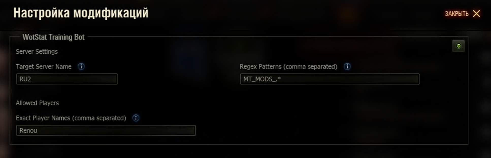

# Training Bot

> [!CAUTION]
> All code fully generated by AI.
> Весь код полностью сгенерирован ИИ.

Auto accept invites to training rooms in World of Tanks and Mir Tankov.

https://github.com/user-attachments/assets/8f3952b2-e41f-40e0-9f71-966041a22e85

## Как пользоваться
1. Только на сервере **`RU2`**.
2. Пригласите `TRAINING_BOT_RU2` в тренировочную комнату.
3. Бот автоматически примет приглашение.
4. В чате можно отправить команду на смену танка: 
  - `:название_танка`, например `:ис7`.
  - `:id_танка`, например `:g121`.
  - `:tag_танка`, например `:grille_15`.

У вас будет эксклюзивных 15 секунд, что бы запустить бой, после этого времени, бота может перехватить другой игрок (при высоком спросе).

Бот дождётся загрузки боя (чтоб сократить таймер) и выйдет в ангар, в это время его могут перехватить другие игроки.

## Самостоятельный запуск
1. Скачайте и установите мод
2. В настройщике модов можете указать целевой сервер и список никнеймом или regexp игроков, от которых будут приниматься приглашения. Если список пустой, бот будет принимать приглашения от всех игроков.

